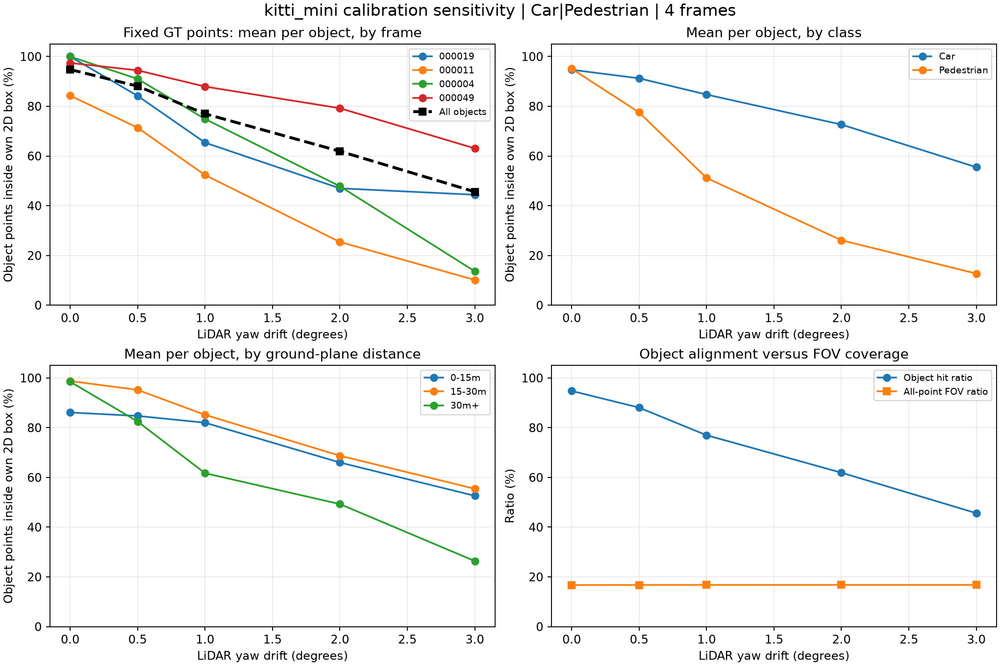
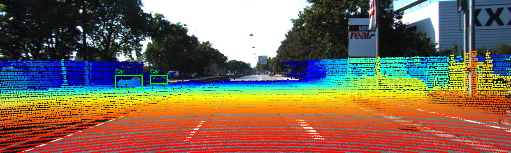
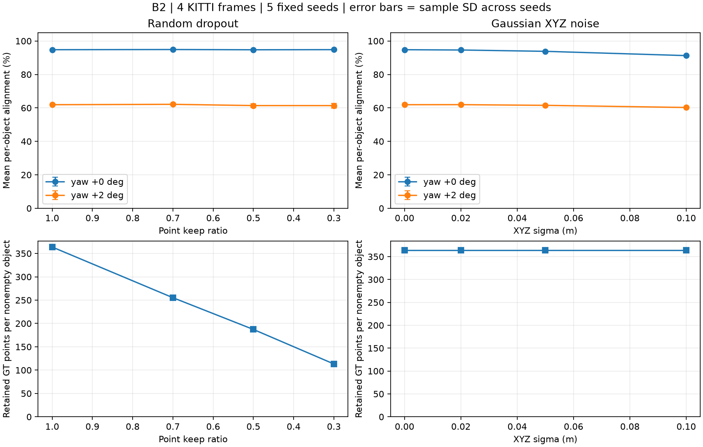
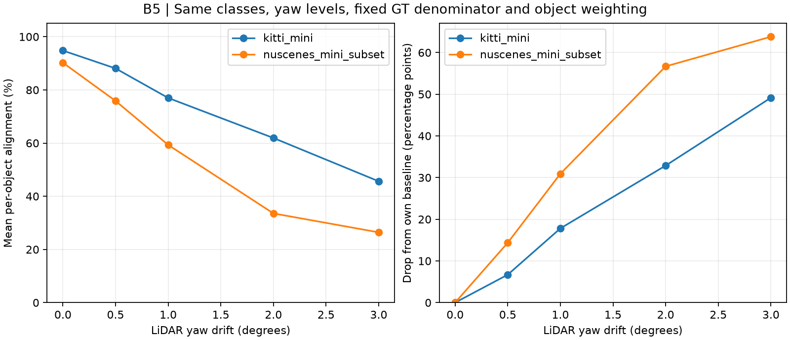
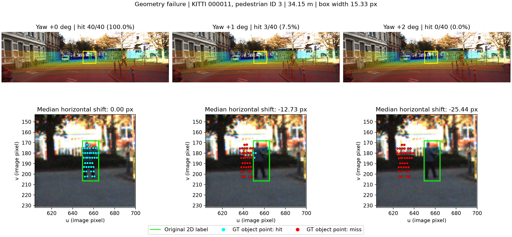
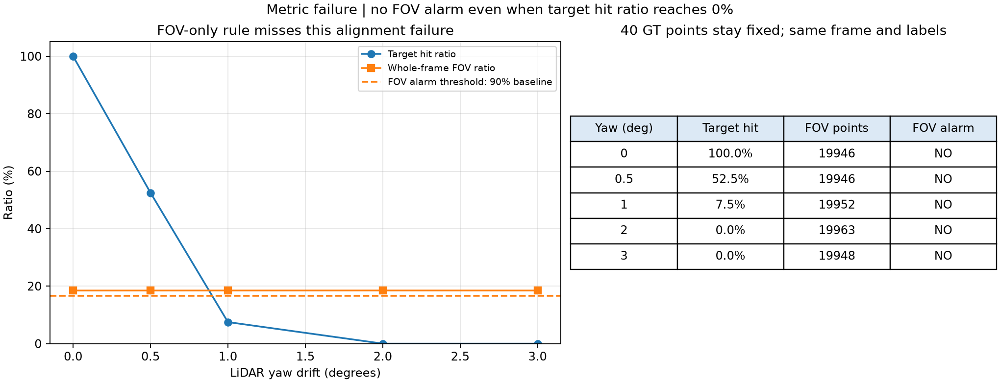

# Báo cáo Day 6: Độ nhạy của phép chiếu LiDAR-camera với lệch yaw

- **Họ tên:** Phạm Xuân Quý
- **MSSV:** 2A202602745
- **Lớp:** VinUni AI20K — Track 4: Computer Vision and Robotics
- **Link repo:** https://github.com/quycute2003/PhamXuanQuy-2A202602745-Track4-Day21
- **Topic:** A — LiDAR-camera projection QA
- **Dataset:** data/kitti_mini (thí nghiệm chính, B2/B3); data/synthetic (debug); data/nuscenes_mini_subset (CP2 và so sánh B5).
- **Các frame đã dùng:** KITTI 000019 (vật gần), 000011 (người đi bộ), 000004 (xe xa), 000049 (che khuất); synthetic 000000; nuScenes scene-0103_010, scene-0103_020 (ngày), scene-1094_010, scene-1094_020 (đêm).

## 1. Claim

**Claim đã kiểm chứng ở CP3:** Trên 26 vật thể Car/Pedestrian của 4 frame KITTI 000019, 000011, 000004 và 000049, lệch yaw +2° quanh trục z của LiDAR làm tỉ lệ điểm chiếu đúng vào 2D box tương ứng, trung bình đều theo vật thể, giảm từ **94.79% xuống 61.91%**, tức **32.88 điểm phần trăm**. Kết quả ủng hộ giả thuyết CP1 “giảm ít nhất 10 điểm phần trăm” trên mẫu đã chọn.

**Thí nghiệm:** Quét yaw 0°, +0.5°, +1°, +2°, +3°; giữ nguyên frame, điểm đầu vào, class Car/Pedestrian, translation và các góc khác; không giới hạn range và không dùng phép ngẫu nhiên. Đo thêm % điểm toàn frame nằm trong FOV, tách kết quả theo class và khoảng cách mặt phẳng camera `sqrt(x² + z²)`.

**Định nghĩa metric:** Chọn cố định các điểm hữu hạn nằm trong 3D box GT bằng calibration gốc; với mỗi vật thể có điểm, chia số điểm chiếu đúng vào 2D box của chính vật thể đó cho tổng số điểm đã chọn. Điểm ra ngoài ảnh hoặc sau camera vẫn nằm trong mẫu số và được tính là không khớp; lấy trung bình đều theo vật thể, bỏ DontCare và box không có điểm.

**Phạm vi:** Kết luận áp dụng cho 4 frame và yaw dương đã đo; chưa suy rộng cho toàn KITTI hoặc sensor khác. Label 2D/3D, truncation và occlusion ảnh hưởng baseline, nên không giả định calibration gốc luôn đạt 100%.

## 2. Evidence

**Benchmark CP3:** 4 frame × 5 mức yaw = 20 cấu hình; 26 vật thể (20 Car, 6 Pedestrian), không có box rỗng. Tập điểm GT và mẫu số của từng vật thể cố định ở cả 5 mức; tổng 9459 lượt điểm trong các box. Chạy hai lần, cả 4 CSV giống nhau từng byte.

| Yaw | Khớp box trung bình theo vật thể | Giảm so với 0° (điểm phần trăm) | Điểm toàn frame trong FOV |
|---|---|---|---|
| 0° | 94.79% | 0.00 | 16.740% |
| +0.5° | 88.08% | 6.70 | 16.755% |
| +1° | 76.98% | 17.81 | 16.767% |
| +2° | 61.91% | 32.88 | 16.781% |
| +3° | 45.63% | 49.16 | 16.781% |



Ở +2°, Car giảm **94.69% → 72.65%** (22.05 điểm phần trăm), Pedestrian giảm **95.09% → 26.12%** (68.97 điểm phần trăm): người đi bộ nhạy hơn trong mẫu này. Nhóm trên 30 m (8 vật thể) giảm **98.51% → 49.29%**, nhóm dưới 15 m (8 vật thể) giảm **86.10% → 66.00%**; đây là mô tả theo nhóm, chưa tách ảnh hưởng class/truncation khỏi khoảng cách.

FOV thay đổi chỉ **+0.041 điểm phần trăm** ở +2° dù mức khớp box giảm **32.88 điểm phần trăm**, nên FOV đơn lẻ không đủ để phát hiện drift trong thí nghiệm này. Baseline khớp box cố định là **94.79%**, khác **99.40%** của metric gộp chỉ tính điểm còn trong ảnh; ví dụ Car trong frame 000011 bị truncation 0.98. Không loại điểm ngoài FOV khỏi mẫu số để tránh che mất lỗi projection.

File: `results/yaw_perturb_sweep.csv` (20 dòng theo frame), `results/yaw_perturb_sweep_objects.csv` (130 dòng theo vật thể), `results/yaw_perturb_sweep_groups.csv` (25 dòng theo class/range), `results/yaw_perturb_sweep_summary.csv` (5 dòng tổng hợp). `mean_hit_ratio` là metric của claim; `pooled_hit_ratio` gộp theo số điểm; `visible_hit_ratio` là metric tham chiếu của script mẫu. Self-test CP3 khớp đủ 15 số tham chiếu trên 000008/000011/000049 với class Car/Van/Pedestrian/Cyclist, kiểm tra box xoay, mẫu số cố định và cách lấy trung bình.

**Demo CP2:** Self-test và 7 overlay đã chạy; số điểm trong ảnh của ba ca chuẩn là 3910 / 19946 / 3120, khớp hướng dẫn. Frame 000008 chỉ dùng đối chiếu script mẫu trong self-test CP3, không nằm trong benchmark 4 frame của claim.




Nguồn ảnh: KITTI Vision Benchmark Suite; ảnh kiểm tra bổ sung từ nuScenes (Motional). Các ảnh còn lại nằm trong `results/figures/`, tái tạo bằng các lệnh ở mục 5. Quan sát synthetic yaw +2°: điểm trượt ngang khỏi cột và mép xe, nhưng FOV chỉ thay đổi từ 16.3% lên 16.5%; vì vậy FOV đơn lẻ chưa đủ để đánh giá calibration.

**[B2] Stress test (+3 tối đa):** Sau khi đủ 5 sản phẩm bắt buộc, chạy `random_dropout` và `gaussian_noise` từ `starter/perturb.py`, mỗi loại 3 mức suy giảm cộng baseline, trên cùng 4 frame/class/GT của CP3. Seed cố định 0–4; tại mỗi cấu hình suy giảm so yaw 0° với +2° trên đúng cùng tập điểm và seed. Nhiễu giữ nguyên membership GT gốc; dropout chỉ tính các điểm GT còn giữ lại, không coi điểm bị xóa là lỗi alignment. Box rỗng được ghi riêng và loại khỏi trung bình; bảng là trung bình 5 seed, không phải một lần đo.

| Suy giảm | Mức | Khớp box yaw 0° | Khớp box yaw +2° | Điểm GT/vật thể không rỗng |
|---|---|---|---|---|
| Dropout | giữ 100% | 94.79% | 61.91% | 363.81 |
| Dropout | giữ 70% | 94.89% | 62.14% | 255.22 |
| Dropout | giữ 50% | 94.75% | 61.39% | 187.19 |
| Dropout | giữ 30% | 94.82% | 61.38% | 113.21 |
| Gaussian XYZ | sigma 0 m | 94.79% | 61.91% | 363.81 |
| Gaussian XYZ | sigma 0.02 m | 94.61% | 61.94% | 363.81 |
| Gaussian XYZ | sigma 0.05 m | 93.82% | 61.53% | 363.81 |
| Gaussian XYZ | sigma 0.10 m | 91.26% | 60.25% | 363.81 |



Dropout giảm mạnh số điểm nhưng không làm tỉ lệ khớp của điểm còn lại giảm tương ứng: metric alignment không thay thế metric mật độ/độ phủ vật thể. Ở mức giữ 30% và 50%, một số seed chỉ còn 25/26 box có điểm, nên cần báo cả box rỗng để thấy giới hạn của score; sigma 0.10 m làm baseline giảm 3.52 điểm phần trăm. File `bonus_stress.csv` có 320 dòng theo frame, `bonus_stress_summary.csv` có 80 cấu hình/seed, `bonus_stress_aggregated.csv` có 16 dòng tổng hợp; nằm trong `results/`. Chạy lại cả 3 CSV giống từng byte; error bar là SD giữa 5 seed, không phải khoảng tin cậy.

**[B3] Latency (+2 tối đa):** Đo `run_one(prepared, 2)` bằng `time.perf_counter`, CPU, frame và mask GT đã cache; gồm perturb extrinsic, chiếu, tính hit và tổng hợp, **không gồm** I/O, chọn GT ban đầu hay vẽ ảnh. Mỗi frame chạy 21 lần: bỏ warmup đầu, lấy p50/p95 của 20 lần sau; chạy riêng, không chạy stress test đồng thời.

| Frame | Số lần đo sau warmup | p50 (ms) | p95 (ms) |
|---|---|---|---|
| 000019 | 20 | 11.32 | 11.91 |
| 000011 | 20 | 20.26 | 22.10 |
| 000004 | 20 | 17.96 | 18.78 |
| 000049 | 20 | 22.72 | 26.30 |

Phần cứng: Intel Core i5-12500H, RAM hệ thống báo 15.71 GiB, có Intel Iris Xe và NVIDIA RTX 3050 Laptop nhưng phép đo không dùng GPU. `results/bonus_latency.csv` lưu 84 lần chạy, cột `warmup` chỉ rõ 4 lần bị loại; `bonus_latency_summary.csv` và `bonus_hardware.json` lưu phân vị, phần cứng/phiên bản Python-thư viện. Thời gian là số đo trên máy này, có thể đổi theo tải; đã đối chiếu p50/p95 với CSV gốc.

**[B4] Tool dùng lại (+3 tối đa):** `src/exp_yaw_sweep.py` có mặc định chạy ngay, tham số dataset/frame/class/yaw/CSV, mỗi tham số có `help=...`; xuất chi tiết theo vật thể, class/range và tổng hợp. `src/plot_yaw_sweep.py` đọc các CSV và tự lấy tên dataset/class/số frame cho tiêu đề. Hướng dẫn và ví dụ đổi sang nuScenes ở mục 5; đã kiểm tra `--help` và chạy cả hai dataset.

**[B5] Cùng thí nghiệm trên 2 dataset (+2 tối đa):** Dùng đúng script CP3, class Car/Pedestrian, 5 mức yaw, membership GT cố định và trung bình đều theo vật thể. KITTI dùng 4 frame trên; nuScenes dùng 2 frame ngày + 2 frame đêm nêu ở đầu REPORT, giữ bù ego-motion mặc định. Kết quả lưu `results/yaw_nuscenes_sweep*.csv` và `bonus_dataset_comparison.csv`; metadata camera/timestamp ở `bonus_dataset_context.csv`.

| Yaw | KITTI khớp box | nuScenes khớp box | KITTI giảm so baseline (điểm %) | nuScenes giảm so baseline (điểm %) |
|---|---|---|---|---|
| 0° | 94.79% | 90.22% | 0.00 | 0.00 |
| +0.5° | 88.08% | 75.85% | 6.70 | 14.37 |
| +1° | 76.98% | 59.31% | 17.81 | 30.92 |
| +2° | 61.91% | 33.54% | 32.88 | 56.68 |
| +3° | 45.63% | 26.43% | 49.16 | 63.80 |



KITTI trung bình 113342 điểm/frame, nuScenes 34720 (LiDAR 64 so với 32 beam theo tài liệu repo). NuScenes có 44/59 box Car/Pedestrian có điểm, so với KITTI 26/26; class mix cũng khác (nuScenes 26 Car/18 Pedestrian, KITTI 20/6). Score trên box ít điểm rời rạc hơn và các cảnh không ghép cặp, nên không thể quy chênh lệch chỉ cho beam hoặc ngày/đêm.

Camera KITTI `fx=721.54`, ảnh 1242×375; nuScenes `fx=1252.81–1266.42`, ảnh 1600×900. Gần trục ảnh, yaw 1° cho quy mô dịch 12.59 px so với 21.87–22.11 px, tương ứng 1.01% so với 1.37–1.38% chiều rộng ảnh: ảnh lớn hơn bù một phần dịch pixel. Tiêu cự cũng phóng to box nên riêng `fx` không chứng minh được vì sao hit ratio giảm mạnh hơn; phân bố khoảng cách/class/truncation góp phần vào chênh lệch quan sát.

Khác biệt label đáng lưu ý: KITTI có label 2D riêng, còn `starter/nuscenes_io.py` tạo box 2D từ 8 góc box 3D rồi clip vào ảnh; đây là hạn chế khi so sánh score như độ chính xác tuyệt đối. Camera nuScenes sớm hơn LiDAR 35.02–37.27 ms trong 4 frame, đã bù ego-motion; chưa loại hết chuyển động vật thể. Cả 4 CSV nuScenes tái lập giống từng byte. Tổng mức bonus xin xét B2+B3+B4+B5 là tối đa **10**, phụ thuộc tiêu chí bắt buộc và giảng viên, không tự coi là điểm đã đạt.

## 3. Failure case



- **Trường hợp:** KITTI `000011`, người đi bộ thứ 3, `fr["labels"][3]` (index từ 0), cách 34.15 m; box rộng 15.33 pixel, `occluded=0`, `truncated=0`. Giả lập extrinsic lệch yaw, giữ nguyên 40 điểm GT, label, intrinsic và các tham số khác.
- **Quan sát:** Điểm khớp box giảm **40/40 (100%) → 21/40 (52.5%) → 3/40 (7.5%) → 0/40 (0%)** ở yaw 0° / +0.5° / +1° / +2°. Cả 40 điểm vẫn nằm trong ảnh; ảnh zoom chỉ vẽ điểm của vật thể này, xanh lam là khớp và đỏ là trượt ra ngoài box.
- **Nguyên nhân:** Với `fx=721.54 px`, quy mô dịch ngang `fx·tan(1°) ≈ 12.59 px`; số đo trung vị trên đúng 40 điểm là **12.73 px sang trái** ở +1° và **25.44 px** ở +2°, lớn so với box rộng **15.33 px**. Điểm của vật hẹp trượt khỏi label dù vẫn còn trong FOV.
- **Lớp debug:** **Geometry** — extrinsic bị perturb có kiểm soát, không phải lỗi code chiếu. Self-test CP2 và 15 giá trị tham chiếu CP3 đã qua; vị trí GT được chọn bằng calibration gốc nên không đổi theo yaw.
- **Phát hiện/khắc phục:** Trong kiểm tra định kỳ có GT hoặc bảng chuẩn, đề xuất cảnh báo khi `hit_ratio < 80% baseline` với ≥20 điểm và box không truncated/occluded; ca này báo từ +0.5°. Kiểm tra gá sensor và hiệu chỉnh extrinsic. Khi chạy trực tuyến không có GT 3D, cần dùng score khớp biên hoặc đối chiếu vật thể 2D đã track, ghi log sai lệch pixel và hiệu chuẩn ngưỡng trên nhiều scene; ngưỡng 80% hiện chỉ là đề xuất cho ca này.



- **Trường hợp:** Cùng frame/vật thể, thử quy tắc cảnh báo chỉ khi tỉ lệ FOV giảm dưới **90% baseline**. Đây là quy tắc minh họa, không phải ngưỡng đã được xác nhận cho triển khai.
- **Quan sát:** Yaw +2° làm target khớp box **100% → 0%**, nhưng số điểm toàn frame trong ảnh **19946 → 19963**, FOV **18.4678% → 18.4836%**. Quy tắc FOV không báo ở bất kỳ mức +0.5° / +1° / +2° / +3° nào đã thử.
- **Nguyên nhân:** FOV chỉ đo điểm có nằm trong khung ảnh, không đo khớp vật thể; trượt ngang vài chục pixel chưa làm 40 điểm của người đi bộ rời ảnh. Vì thế một metric phủ ảnh có thể bỏ sót lỗi alignment nghiêm trọng.
- **Lớp debug:** **Metric** — giới hạn của cách đo/cảnh báo, tách biệt với nguyên nhân Geometry tạo ra lệch projection.
- **Phát hiện/khắc phục:** Giữ FOV để theo dõi vùng phủ, bổ sung metric alignment theo vật thể/biên và so với baseline theo class/range. CSV `results/failure_analysis.csv` lưu cả hai cờ cảnh báo cùng số điểm và dịch pixel; cần kiểm chứng false alarm/miss trên nhiều frame trước khi dùng ngưỡng thực tế. Nguồn ảnh: KITTI Vision Benchmark Suite.

## 4. Khuyến nghị nếu triển khai thật

Với ADAS hợp nhất LiDAR-camera, kiểm tra calibration sau thay đổi gá sensor và theo dõi alignment trong vận hành; vật hẹp/xa cần được theo dõi riêng vì metric trung bình có thể che mất lỗi. Dùng FOV cho vùng phủ, thêm sai lệch pixel/score khớp biên, lượng điểm trên vật thể, class/range và timestamp vào log.

Đánh đổi: chỉ đếm FOV nhanh nhưng bỏ sót drift; đối chiếu theo vật thể/biên cần thêm xử lý ảnh và điều kiện đủ điểm. Khi không có GT online, dùng đối tượng tĩnh được track hoặc bảng chuẩn trong kiểm tra định kỳ; đánh dấu phép hợp nhất thiếu tin cậy khi alignment bất thường và ưu tiên kiểm tra/hiệu chỉnh sensor.

Bước tiếp theo: kiểm chứng ngưỡng trên nhiều scene, cả yaw âm, pitch/roll, dịch chuyển và thời gian LiDAR-camera; đo false alarm/miss trước khi áp dụng cảnh báo. Ngưỡng 80% baseline của CP4 là minh họa trên một vật thể, chưa phải ngưỡng an toàn đã xác nhận.

## 5. Cách chạy lại

Chạy từ thư mục gốc repo bằng Windows PowerShell, Python 3.11. Dùng trực tiếp Python trong `.venv` để không phụ thuộc việc kích hoạt môi trường hay execution policy; `-X utf8` tránh lỗi đọc tiếng Việt trên Windows.

```powershell
py -3.11 -m venv .venv
.\.venv\Scripts\python.exe -X utf8 -m pip install -r requirements.txt
.\.venv\Scripts\python.exe -X utf8 tools/verify_data.py --data-root data/kitti_mini
.\.venv\Scripts\python.exe -X utf8 tools/verify_data.py --data-root data/nuscenes_mini_subset
.\.venv\Scripts\python.exe -X utf8 -m src.test_projection
.\.venv\Scripts\python.exe -X utf8 -m starter.projection --data-root data/synthetic --frame 000000
.\.venv\Scripts\python.exe -X utf8 -m starter.projection --data-root data/synthetic --frame 000000 --yaw-deg 2
.\.venv\Scripts\python.exe -X utf8 -m starter.projection --data-root data/kitti_mini --frame 000019
.\.venv\Scripts\python.exe -X utf8 -m starter.projection --data-root data/kitti_mini --frame 000011
.\.venv\Scripts\python.exe -X utf8 -m starter.projection --data-root data/kitti_mini --frame 000004
.\.venv\Scripts\python.exe -X utf8 -m starter.projection --data-root data/kitti_mini --frame 000049
.\.venv\Scripts\python.exe -X utf8 -m starter.projection --data-root data/nuscenes_mini_subset --frame scene-0103_010
.\.venv\Scripts\python.exe -X utf8 -m src.test_yaw_sweep
.\.venv\Scripts\python.exe -X utf8 -m src.exp_yaw_sweep --data-root data/kitti_mini --frames 000019 000011 000004 000049 --classes Car Pedestrian --yaw-levels 0 0.5 1 2 3
.\.venv\Scripts\python.exe -X utf8 -m src.plot_yaw_sweep
.\.venv\Scripts\python.exe -X utf8 -m src.analyze_failure
.\.venv\Scripts\python.exe -X utf8 -m src.exp_yaw_sweep --data-root data/nuscenes_mini_subset --frames scene-0103_010 scene-0103_020 scene-1094_010 scene-1094_020 --out results/yaw_nuscenes_sweep.csv
.\.venv\Scripts\python.exe -X utf8 -m src.plot_yaw_sweep --csv results/yaw_nuscenes_sweep.csv --out results/figures/yaw_nuscenes_sweep.png
.\.venv\Scripts\python.exe -X utf8 -m src.bonus_experiments --seeds 0 1 2 3 4 --repeats 20
```

Self-test phải in `CP2 self-test passed`; hai lệnh kiểm tra dữ liệu phải in `[PASS]`. Self-test kiểm tra điểm chuẩn, NaN/Inf, điểm sau camera, ngoài FOV, ngưỡng depth, biên ảnh, input rỗng, mẫu số chiếu bằng 0 và thứ tự mask/depth. Ảnh overlay được lưu trong `results/figures/`; nuScenes dùng bù ego-motion mặc định.

Tự kiểm tra tái lập CP3 (cùng frame/class/mức yaw mặc định như lệnh benchmark trên):

```powershell
.\.venv\Scripts\python.exe -X utf8 -m src.exp_yaw_sweep --out results/check_rerun.csv
@'
import filecmp
for suffix in ('', '_objects', '_groups', '_summary'):
    assert filecmp.cmp(f'results/yaw_perturb_sweep{suffix}.csv', f'results/check_rerun{suffix}.csv', shallow=False), suffix
print('All 4 CSV files are byte-identical')
'@ | .\.venv\Scripts\python.exe -X utf8 -
Remove-Item -LiteralPath results\check_rerun.csv, results\check_rerun_objects.csv, results\check_rerun_groups.csv, results\check_rerun_summary.csv
```

`src.test_yaw_sweep` phải in `CP3 metric self-test passed`. Hai script thí nghiệm/vẽ có `--help` để đổi dataset, frame, class, mức yaw hoặc đường dẫn kết quả. Không có phép ngẫu nhiên nên không cần seed. Kết quả tái lập không bao gồm thời gian chạy hoặc metadata PNG.

`src.analyze_failure` tái tạo `results/failure_analysis.csv` (5 mức yaw) và hai ảnh `fail_01_yaw_narrow_pedestrian.png`, `fail_02_fov_metric_false_negative.png`. Có `--csv` và `--out-dir` để đổi nơi lưu; số đếm khớp dữ liệu theo vật thể/frame của CP3, cùng tập GT cố định.

**[B4]** Chạy không tham số: `python -m src.exp_yaw_sweep`; xem hướng dẫn: `python -m src.exp_yaw_sweep --help`, `python -m src.plot_yaw_sweep --help`, `python -m src.bonus_experiments --help` trong môi trường đã cài. Ví dụ quét ngắn: `python -m src.exp_yaw_sweep --frames 000011 --yaw-levels 0 1 2 --out results/custom_sweep.csv`, sau đó `python -m src.plot_yaw_sweep --csv results/custom_sweep.csv --out results/figures/custom_sweep.png`.

Bonus có thể chạy riêng với `--mode stress`, `--mode latency`, `--mode compare`; mode compare cần có hai bộ CSV KITTI/nuScenes do lệnh trên tạo. Stress dùng seed cố định để so CSV; latency là số đo thời gian mới mỗi lần chạy nên không yêu cầu giống byte.

## 6. Khai báo sử dụng AI

Tôi sử dụng Codex (OpenAI) để hỗ trợ thực hiện bài lab theo các checkpoint. Phần hỗ trợ gồm đọc yêu cầu, đề xuất claim và cách đo, viết hai hàm projection, các script thí nghiệm/kiểm tra, vẽ hình và soạn báo cáo. Code và phần diễn giải được AI hỗ trợ đáng kể; số liệu và ảnh trong bài được tạo từ code chạy trên dữ liệu của repo.

| Công cụ / nguồn | Phạm vi sử dụng | Kiểm chứng đã thực hiện trong repo |
|---|---|---|
| Codex (OpenAI) | Hỗ trợ viết code, thiết kế và chạy thí nghiệm, phân tích failure, vẽ biểu đồ, biên tập báo cáo | Công cụ đã thực thi self-test projection/metric, đối chiếu số tham chiếu, kiểm tra checksum, so CSV giữa hai lần chạy, kiểm tra mẫu số GT và warmup/latency; ảnh kết quả đã được xem lại trong phiên làm việc. |
| Codelab Day 6 và code starter của đề bài | Tham khảo phép chiếu, chọn điểm trong box, yaw sweep và giao thức đo latency; dùng các hàm perturb có sẵn | Script mẫu được mở rộng với mẫu số GT cố định, trung bình theo vật thể và tách class/range; metric tham chiếu khớp 15 giá trị của đề. Nguồn được ghi trong docstring các script. |

Các kiểm tra trên do Codex thực thi trong phiên hỗ trợ, không phải xác nhận rằng tôi đã tự kiểm chứng toàn bộ độc lập. Tôi chịu trách nhiệm về bài nộp và cần nắm được công thức chiếu, cách tính metric, nguồn số liệu và giới hạn của kết luận.
